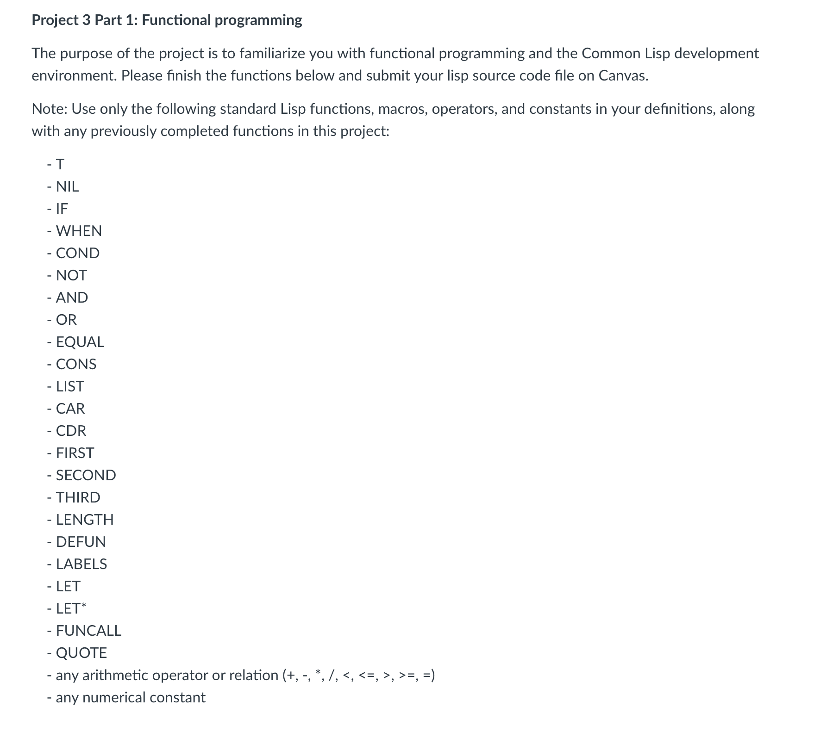

# bug-free-waddle

## Getting Started

### Files
- project3.lisp: This file contains the Lisp code for your project
- runProject3.sh: A shell script to run the Lisp code
- projectRequirements.png: Informational image about project requirements

### Download and Install SBCL
- Visit the [SBCL website](https://www.sbcl.org/platform-table.html) to download SBCL.
- Follow the installation instructions for your operating system

### Executing .lisp
- cd into directory of project
- ./runProject3.sh
    
